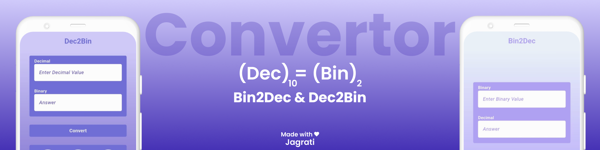

# 🔢 Binary ↔ Decimal Converter

  

A simple and efficient application that converts **Binary numbers to Decimal** and **Decimal numbers to Binary**.
 
This project is designed to help beginners understand number system conversions.

## ✨ Features

- Convert Binary to Decimal
- Convert Decimal to Binary
- Fast and accurate conversions
- Beginner-friendly logic
- Clean and simple UI (if Flutter-based)
