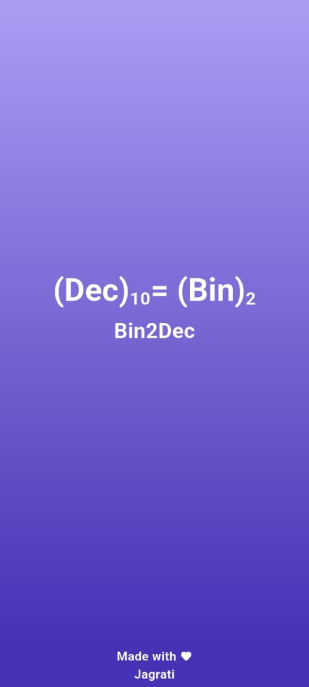
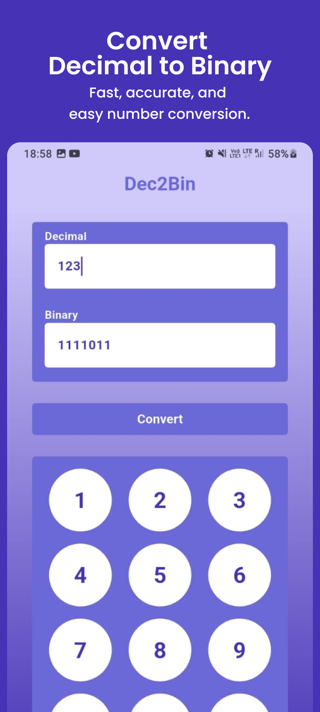
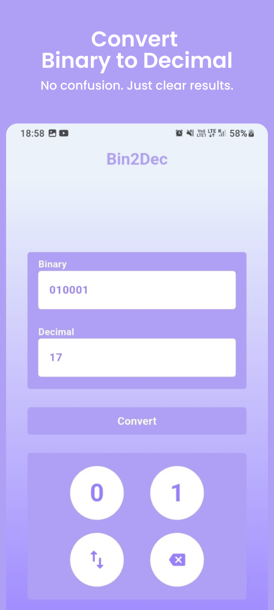

# 🔢 Binary ↔ Decimal Converter
<p align="center">
  
</p>

A simple and efficient application that converts **Binary numbers to Decimal** and **Decimal numbers to Binary**.
<br>

## ✨ Features

- Convert Binary to Decimal
- Convert Decimal to Binary
- Fast and accurate conversions
- Beginner-friendly logic
- Clean and simple UI

## 🛠 Tech Stack

- **Flutter (Dart)** – App Development  
- **Figma** – UI/UX Design  
- **Material UI** – Consistent design system
## 📸 App Screenshots
<p>
  
  
  
</p>

## 🚀 Getting Started

### Prerequisites
- Flutter SDK installed
- Android Studio / VS Code
- Emulator or physical device

### Installation

```bash
git clone https://github.com/jagrati7305/binary-to-decimal-convertor
cd binary-to-decimal-convertor
flutter pub get
flutter run
